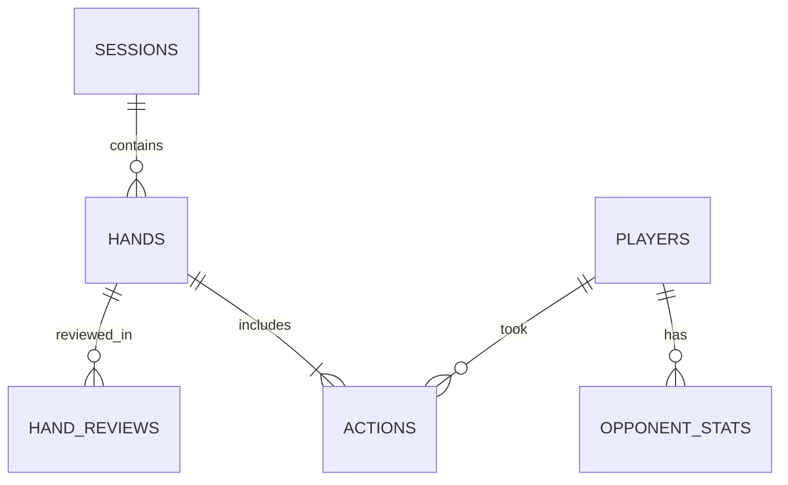
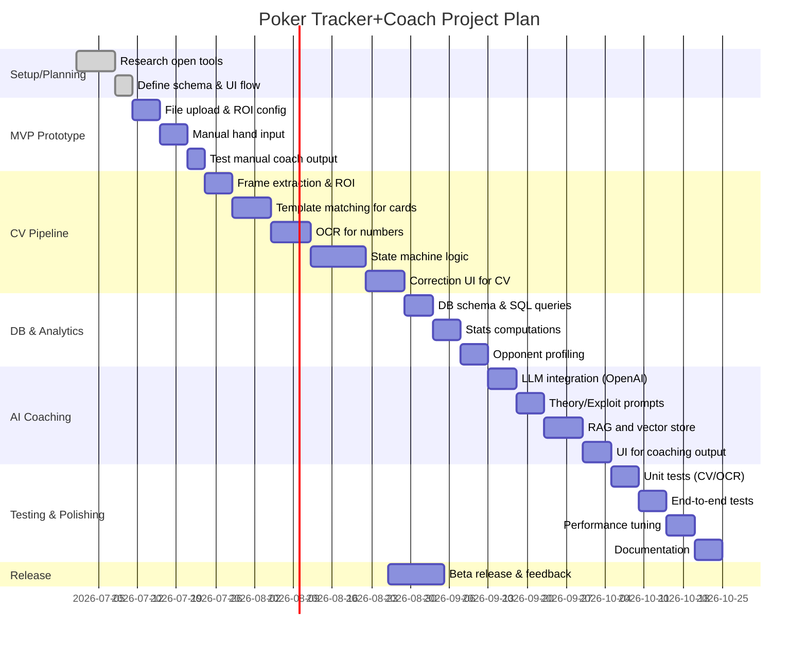

# Executive Summary

This report outlines a comprehensive design for a **post-session poker tracker and AI coach**. The system processes recorded ClubWPT Gold sessions (fixed-table video) and produces structured hand histories, database stats, and intelligent coaching feedback. We assume *local-first development*, with video files and a SQLite database on the user’s machine, and optional cloud APIs (e.g. LLMs) for advanced analysis. Crucially, this is *post-session only* – no real-time advice – to comply with ClubWPT Gold’s rules against RTA (real-time assistance). 

**Key components**: 
- **Computer Vision pipeline** (frame extraction, ROI cropping, card detection, OCR) to reconstruct each hand. 
- **Database** (SQLite) for sessions, hands, actions, players, and reviews. 
- **State machine logic** to infer street transitions (preflop, flop, turn, river) and actions from CV outputs. 
- **LLM-based coaches** with two modes: *Exploit Coach* (practical, opponent-focused advice) and *Theory Coach* (range, equity, bet-sizing fundamentals).  
- **Equity and solver integration**: use open libraries (pbots_calc, eval7) for equity; optionally run an open solver (TexasSolver, WASM Postflop) to validate or explain lines. 
- **UI/UX**: a Streamlit (or similar) interface for video upload, ROI calibration, hand review, manual corrections, and final reports. 

A **prioritized roadmap** will start with a minimal MVP (frame capture, manual hand input, basic coach prompts) and evolve through stages adding CV automation, OCR, full hand reconstruction, and LLM fine-tuning. We emphasize modular, test-driven development: separate pipelines for vision, database, and AI reasoning, with human-in-the-loop correction at each step. Security measures include ensuring no live table hooking and clear disclaimers. The goal is a **powerful study tool** (not a cheating bot), helping players find leaks and learn both exploitative and GTO-inspired strategy. 

Below we provide detailed architecture diagrams (using mermaid), data schemas, algorithmic design, tech comparisons, testing plans, and an implementation Gantt chart. Primary sources and open projects (TexasSolver, pbots_calc, WASM Postflop, etc.) are cited throughout. The final design can serve as a blueprint for building a custom poker tracker/coach end-to-end.

## System Architecture

The system has three main subsystems: (1) **Video Processing** (CV and OCR), (2) **Database & Analytics**, and (3) **AI Coaching/UI**. The overall **data flow** is: user uploads a recorded session video; the **CV pipeline** extracts frames, detects cards, stacks, bets, and infers each hand’s structure; all data is stored in **SQLite**; an **analysis engine** computes session stats and opponent profiles; an **LLM-based coach** then generates textual feedback. The UI allows ROI calibration and manual corrections at each stage.

```mermaid
flowchart LR
    subgraph Video Input
      A[Video file (ClubWPT gold session)] --> B{Frame Extraction}
    end
    subgraph Computer Vision
      B --> C[ROI Cropping (Hero cards, Board, Pot, Stacks, Buttons)]
      C --> D[Card Detection (template or ML)] 
      C --> E[OCR on Pot & Stacks]
      D --> F[Detected Cards]
      E --> F[Detected Text/Numbers]
      F --> G[Hand State Inference]
    end
    subgraph Database/Analytics
      G --> H[Hand History Records]
      H --> I[Compute Stats & Profiles]
    end
    subgraph AI Coaching
      I --> J[Retrieval/RAG of strategy notes]
      J --> K[LLM Coach (Theory/Exploit)]
    end
    subgraph UI
      A & G & K --> M[User Interface (review, correct, results)]
    end
```

The **Hand State Inference** produces structured outcomes like: “Hand #23: SB 50/100, Hero (BTN) vs Villain (CO), Hero’s cards As-Qh, actions… result.” These are stored in tables. The **Analytics** layer computes metrics (VPIP, PFR, 3-bet%, c-bet, etc.) and aggregates “player profiles” (e.g. loose-passive, TAG, etc.). The **AI Coach** reads the hand data (and optionally relevant notes/examples via RAG) and outputs multi-part analysis in both *Theory* and *Exploit* modes. The UI (e.g. a Streamlit dashboard) ties it together: video upload, ROI config, frame-by-frame previews, hand timeline visualizer, and editable transcripts.

## Data Model and Database Schema

A **relational database** (SQLite for MVP, possibly PostgreSQL later) will hold all extracted data. Key tables include **sessions, hands, actions, players, opponents, hand_reviews**, etc. Below is a sample simplified schema:

```sql
-- Tables for sessions and raw video info
CREATE TABLE sessions (
    session_id     INTEGER PRIMARY KEY,
    date_played    TEXT,         -- e.g. 2026-07-02
    platform       TEXT,         -- e.g. 'ClubWPT Gold'
    stakes         TEXT,         -- e.g. '$50/$100'
    video_path     TEXT,         -- local filepath
    notes          TEXT
);

-- Each hand within a session
CREATE TABLE hands (
    hand_id        INTEGER PRIMARY KEY,
    session_id     INTEGER,
    hand_number    INTEGER,
    start_time     REAL,         -- seconds in video
    end_time       REAL,
    hero_position  TEXT,         -- 'BTN','SB','BB', etc.
    hero_cards     TEXT,         -- 'As Qh'
    board_cards    TEXT,         -- 'Qd 7s 2c 9h 3s'
    pot_size       REAL,         -- final pot at showdown
    result         TEXT,         -- 'Hero wins' or 'Villain wins'
    hero_bb_won    REAL,         -- +BB if won, -BB if lost
    FOREIGN KEY(session_id) REFERENCES sessions(session_id)
);

-- Actions in each hand, sequential
CREATE TABLE actions (
    action_id      INTEGER PRIMARY KEY,
    hand_id        INTEGER,
    street         TEXT,    -- 'preflop','flop','turn','river'
    action_idx     INTEGER, -- order on that street
    player_name    TEXT,
    position       TEXT,    -- e.g. 'BTN','CO', 'SB', etc.
    action_type    TEXT,    -- 'fold','call','raise','bet','check'
    amount         REAL,    -- chips put in
    pot_before     REAL,
    stack_before   REAL,
    timestamp      REAL,    -- seconds in video
    FOREIGN KEY(hand_id) REFERENCES hands(hand_id)
);

-- Known players (hero and frequent opponents)
CREATE TABLE players (
    player_name    TEXT PRIMARY KEY,
    first_seen     TEXT,
    notes          TEXT
);

-- Opponent profiles (aggregated stats)
CREATE TABLE opponent_stats (
    player_name    TEXT,
    hands_played   INTEGER,
    vpip           REAL,
    pfr            REAL,
    three_bet      REAL,
    fold_to_cbet   REAL,
    cbet_flop      REAL,
    aggr_factor    REAL,
    notes          TEXT,
    FOREIGN KEY(player_name) REFERENCES players(player_name)
);

-- AI reviews of hands (theory/exploit mode)
CREATE TABLE hand_reviews (
    review_id      INTEGER PRIMARY KEY,
    hand_id        INTEGER,
    mode           TEXT,    -- 'theory' or 'exploit'
    created_at     TEXT,
    content        TEXT,
    FOREIGN KEY(hand_id) REFERENCES hands(hand_id)
);
```

This schema allows queries like:

- *Session summary*: total hands, winrate, VPIP/PFR.  
- *Leak queries*, e.g. “All hands where hero flopped top pair but checked” or “Villain X’s 3-bet opportunities”.  
- *Opponent scouting*, using opponent_stats (VPIP/PFR from actions).  

A simple ER diagram (mermaid) illustrates main relations:



Most fields are straightforward (e.g. hero_cards as text “As Qh”). Indexes on `hand_id`, `session_id`, and `player_name` will speed queries. Using **SQLAlchemy** or similar ORM can simplify coding, but raw SQL is also fine for learning.

## Computer Vision Pipeline

Because the ClubWPT Gold view is *fixed and consistent*, we can exploit static ROIs. The pipeline is:

1. **Frame Extraction**: Sample frames at e.g. 3–5 fps, or only on UI changes (detect pixel difference). Python’s OpenCV (`cv2.VideoCapture`) can extract frames.

2. **ROI Cropping**: Define Regions-of-Interest (ROIs) once (via a config or UI) for areas where cards, chips, buttons appear. For example:
   - Hero’s hole cards (bottom center of screen).
   - Flop/Turn/River card positions (fixed on table).
   - Pot size text.
   - Each player’s stack or bet text.
   - Dealer button icon (shows whose turn).
   These ROIs can be hard-coded coordinates if resolution is fixed. The user can calibrate via the UI (drag rectangles).

3. **Card Detection**: Within each card ROI, identify which card (rank+suit) is showing. Options:
   - **Template Matching**: Pre-capture images of all 52 cards from the same client. For each ROI, compute normalized cross-correlation with templates. The best match above a threshold is the card. This is reliable if UI doesn’t change theme.
   - **YOLO/ML**: Train a YOLOv8 or similar model on card images (with dark backgrounds). There are open datasets (e.g. Roboflow) for cards. This is more robust to minor differences but requires training.
   - **Hybrid**: First try template match (fast), if low confidence, fall back to a neural model.

   We strongly recommend **ROI+template** for MVP: it avoids collecting data and works with fixed UI. Save images of each card face as “templates”. The code can simply do `cv2.matchTemplate()`.

4. **OCR for Numbers**: For numeric fields (stack sizes, pot, bet values), use OCR:
   - Crop ROI from each frame.
   - Preprocess: increase contrast, threshold/binarize, optionally scale up (x2 or x3) to help recognition.
   - Use **EasyOCR** or **PaddleOCR** (supports digits and commas). These libraries work well on clear fonts. A dedicated numeric OCR (like Tesseract with digit-only config) may also suffice.
   - Clean results: e.g. fix “1,O00” → “1,000”, parse “.5”k.
   - Because fonts in games can be stylized, expect ~95% accuracy after tuning. Have fallback (manual correction UI) for digits.

5. **Button/Turn Detection**: Identify the dealer button by its location (ROI) and whether it lights up. This tells whose turn each street starts.

6. **Putting it together**: For each frame, the CV output is a set of current visible elements (cards, pot, bet, stacks). Feed this into the state machine (see next section).

**ROI vs YOLO (pros/cons)**:

| Method            | Pros                                              | Cons                                             |
|-------------------|---------------------------------------------------|--------------------------------------------------|
| **ROI+Template**  | No training needed; deterministic; fast in fixed UI | Not robust to UI changes or animations           |
| **YOLO/NN**       | Can learn subtle differences; robust to minor changes | Requires labeled data; overhead to train         |
| **Hybrid**        | Best of both: template for known stable info, model for others | Complexity to manage two systems                 |

Given a **consistent client UI** (ClubWPT desktop view is usually stable), ROI/template is simplest. It can achieve near-perfect detection once ROIs are set correctly. Later, if we support different views or tournaments, adding a ML detector (YOLO) can generalize.

## Hand-State Inference Logic

The CV pipeline produces discrete events per frame: cards appearing, stack changes, etc. We feed this into a **hand-state machine** to build each hand history. Basic logic:

- **New Hand Detection**: When hero cards ROI changes from blank to showing cards, a new hand begins. Record timestamp and initial blinds (parse text).

- **Preflop to Postflop**: Track the street progression:
  - If flop-card ROIs (3 cards) change from blank to cards, transition to *Flop* stage.
  - If turn ROI updates, transition to *Turn*.
  - If river ROI updates, transition to *River*.
  - If the board disappears or UI resets (after showdown), mark hand complete.

- **Action Parsing**: On each street, maintain current *pot size* and each player’s *stack*.
  - If a player’s stack decreases by X and pot increases by X, classify: 
    - If previous pot and stacks show no bet in pot from that player, it’s either a *bet* (if first action on street) or *raise* (if someone had bet). 
    - If player matching previous bet size, it’s a *call*.
  - If stack stays same and turn passes, it’s a *check* or *fold* (fold shows no change).
  - Use the known turn order (button-positional seats) to assign actions. The dealer button ROI tells who starts each street.

- **Ambiguities**: Some folds produce no visible change; we detect folds by noticing pot unchanged and next player action. If two players in a row “skip” with no chips, we infer folded one after another. Logging all stack/pot deltas and matching them to the smallest expected actions helps.

- **Example**: Suppose UTG raises $3, Hero calls, then BB folds preflop. CV sees UTG stack −3, Hero stack −3, pot +6. BB stack no change. We infer: UTG bet 3, Hero call 3, BB fold. On flop, Hero bets $X (stack −X, pot +X), etc.

- **Output Structure**: For each action we insert a row in `actions` table with (street, player, type, amount). When hand completes, we record winner and BB won/lost in `hands`.

This logic can start simple and be refined with testing. Edge cases (all-in, multiway pots, timeouts) can be added later. **Human-in-the-loop** is critical: initially present each detected hand with a UI timeline so the user can correct mislabeled actions (e.g. if OCR misreads a stack, or the bot thought a raise was a call). These corrections update the DB and can be used to improve CV thresholds.

## Computer Vision and OCR Techniques

### Template Matching vs Deep Learning

- **Template Matching**: Fast and deterministic. For each ROI (e.g. a card slot), compute `cv2.matchTemplate` against card templates. If match score > threshold, label that card. Advantage: *no training*, easy to implement with static templates. Disadvantage: must have templates for every game mode/theme; brittle to color shifts.  

- **YOLO/CNN**: Train a model (YOLOv5/v8 or MobileNet) on card images. This handles slight variations and can detect at full image (no fixed ROI needed). However, it needs a training dataset. Public datasets exist for poker cards, but fine-tuning for this specific UI might still be needed. For MVP, we recommend ROI/template, then evaluate if YOLO can complement (especially for detecting actions like “bet” chips or table state).

### OCR Preprocessing

OCR on game text (chips, pot) can be noisy. Key steps:

- Convert ROI to grayscale.
- Increase contrast: use CLAHE or simple histogram equalization.
- Binarize: Otsu’s threshold or fixed threshold to separate digits from background.
- Resize up (e.g. 3×) before OCR to improve accuracy.
- Use EasyOCR/PaddleOCR with digit mode if possible.
- Clean text: remove non-numeric (except k, M, .). For “3.5K” interpret as 3500. 
- Use regex to fix common misreads (e.g. “O”→“0”, “I”→“1”, “S”→“5”).

We expect **OCR char error rate** to be a main error source (a few percent). We will track it (see Testing section). Again, manual correction UI is vital for mislabeled numbers.

### State Machine Pseudocode

A simplified pseudocode for the hand-state logic might be:

```python
state = 'WAITING'
for frame in video_frames:
    if state == 'WAITING':
        if hero_cards_detected(frame):
            state = 'PREFLOP'
            start_new_hand()
    elif state == 'PREFLOP':
        parse_preflop_actions(frame)
        if flop_cards_detected(frame):
            state = 'FLOP'
    elif state == 'FLOP':
        parse_flop_actions(frame)
        if turn_card_detected(frame):
            state = 'TURN'
    elif state == 'TURN':
        parse_turn_actions(frame)
        if river_card_detected(frame):
            state = 'RIVER'
    elif state == 'RIVER':
        parse_river_actions(frame)
        if showdown_or_reset(frame):
            finalize_hand()
            state = 'WAITING'
```

Action parsing updates the `actions` table. On each detected new street, we commit previous street actions.

## AI Coaching Layer (LLM)

After building the hand history and stats, we feed hands (or summaries) into an LLM to generate analysis. Two modes are planned:

- **Theory Coach**: Focus on GTO concepts, ranges, equity, bet sizing theory. This is inspired by fundamentals (e.g. Galfond’s *Run It Once* material). The prompt should encourage range-based reasoning: blocker effects, pot odds, SPR (stack-to-pot ratio), etc.

- **Exploit Coach**: Focus on opponent tendencies, tells, non-GTO adjustments (Charlie Carrel/Hungry Horse style). The prompt should highlight biases, population mistakes (overfolding, overcalling, leak exploitation).

### LLM vs Fine-tuning

Initially, using a strong pre-trained LLM (e.g. GPT-4/4o via API) with carefully crafted prompts is easiest. Over time, one could fine-tune or LoRA-train a smaller model on poker-specific data. But **RAG (Retrieval-Augmented Generation)** is often superior to fine-tuning for domain-specific retrieval. We recommend:

- **Prompting + RAG**: Store the user’s personal notes, solver snippets, and past hand analyses in a vector DB (e.g. with embeddings). Before answering, retrieve relevant info so the model can cite or incorporate it. This avoids repeated fine-tuning and keeps model knowledge up-to-date. It also reduces hallucinations.

- **Future Fine-tuning/LoRA**: Once we have a corpus of (hand_history → desired_analysis) pairs (e.g. after using manual review to gather data), one can fine-tune an open model (Llama-3, Qwen, Mistral, etc.) for style consistency. LoRA or Adapter fusion can make this efficient. But that’s Stage 2.

### Prompts and System Messages

System prompt examples:

```
System: You are a poker strategy coach. Analyze a completed hand (post-play) and provide two analyses: "Theory Coach" and "Exploit Coach". Do NOT give real-time advice. Focus on educational insight, not just telling what to do now. 
Exploit Coach: focus on reads, opponent tendencies, population leaks.
Theory Coach: focus on ranges, equity, bet sizing, pot odds.
Always include: key concept explanation, alternative lines, and a study takeaway.
```

Hand prompt structure:

```
Hand History:
Hero: As Qh on BTN; Villain (HJ) opens 2.5bb; Hero calls; BB calls.
Flop: Qd 7s 2c; HJ bets 40%, Hero calls, BB folds.
Turn: 9h; HJ checks, Hero bets 60%, HJ calls.
River: 3s; HJ checks, Hero checks back. Showdown: Hero shows As Qh, Villain QJ. Hero wins.

Villain profile: HJ is loose-passive (PFR 10%, VPIP 35%).
Hero notes: "Tend to under-value-bet rivers against passive players."

Mode: Exploit Coach
```

Response example excerpts:

- **Exploit**: “This hand features a passive HJ who opened loosely and called your river bet. Against such players, your line is fine, but you may be missing thin value. Villain under-bluffed on the river (likely just QJ), so you should lean towards smaller value bets. Study: Identify worst-case showdown ranges.”
- **Theory**: “AQo on BTN vs CO open: Classic mixed strategy. Calling and 3-betting are both playable. Check your pot odds: on flop you had ~70% equity by call, so calling was OK. Bet sizing theory: when villain checks turn, a 1/2 pot bet is reasonable. Final check back is defensible, but thin value betting adds EV. Study: Learn how to size bets to your range advantage.”

The AI should cite (even internally) any numbers like equity or odds if provided. We can compute equity using **pbots_calc** or **eval7** and feed it to the prompt if needed. E.g., “Your equity vs HJ’s range was ~35%, pot odds 25%, so the call was +EV.”

### Example Prompts (Theory vs Exploit)

- **Theory mode prompt**:  
  “Explain this hand from a theoretical perspective. What range do each of us have on each street? What is the correct play for hero according to pot odds, equity, and balanced strategy? Mention pot odds, minimum defense frequency (MDF), and blockers if relevant. End with a general concept to review (e.g. range advantage, SPR, etc.).”

- **Exploit mode prompt**:  
  “Analyze this hand focusing on the villain’s tendencies. What mistakes might villain be making, and how could hero exploit them? Discuss bet sizing tells, betting/folding patterns, and whether villain is too passive or aggressive. Give a practical adjustment hero could make in future similar spots.”

These prompts (especially with examples) help steer the LLM. We will collect a few example Q&As to guide response format.

## RAG vs Fine-Tuning Tradeoffs

Retrieval-Augmented Generation (RAG) uses external data to ground the LLM. For example, we can store: **solver outputs, strategy notes, previous hand analyses, club pool leaks**. Before answering, retrieve relevant snippets. This ensures up-to-date, specific content. Fine-tuning, by contrast, bakes knowledge into the model weights (expensive and static).

**We recommend RAG first** because:
- Low initial cost: just build a vector store (Chroma, PGVector).
- Continuous updates: add new notes/hands without retraining model.
- Controls hallucinations (source-based answers).

Eventually, after thousands of reviewed hands, we might fine-tune. But even then, fine-tuning is best for enforcing a style (e.g. always output in list form). Content updates remain easier via RAG. (IBM notes that RAG “avoids high retraining costs” and provides “current domain-specific data”.)

A **LoRA plan** could be:
1. Gather 500+ hand reviews (with Theory/Exploit written by coach or known good sources).
2. Fine-tune a base model (e.g. Llama-3 or Llama-4) to produce concise coaching outputs.
3. Continue RAG hybrid use for domain knowledge injection (like specific player stats or solver outputs).

We must also **avoid impersonation** of real players. The coach is *inspired by* Carrel/Galfond, but should *not claim to be them*. We will instruct the AI to use a neutral voice and general poker knowledge, not personal backstories of pros.

## Equity Calculation & Solvers

To support the Theory Coach, we integrate equity and solver calculations. Options:

- **Equity calculators**: 
  - *pbots_calc* (MIT Pokerbots’ ranged equity tool) – C library with Python binding; reliable but somewhat dated.
  - *eval7* – Python library with hand evaluation and equity (Cython accelerated). Easy `pip install`, actively maintained, MIT-licensed.
  - *OMPEval* or similar hand evaluators (fewer high-level features).
  - We recommend **eval7** for MVP (native Python, simple API) and keep pbots as backup.

- **Solvers**:
  - *TexasSolver* – very fast C++ GTO solver that can dump JSON. Free for personal use. Good for flop (their bench showed ~5x Pio speed, alignment with Pio). To use, we’d call the binary or compile library. Provides exact equilibrium strategies for small games.
  - *WASM Postflop (Desktop)* – open, free, can run solver in browser or as desktop app. Desktop version is a native Rust port, best performance. Setup involves downloading and running their UI, not trivial to integrate programmatically, but possible via CLI if exposed.
  - *PioSOLVER Free* – limited flop boards, not very useful beyond examples.
  - *Monte Carlo simulation* – use eval7’s equity or create random deals to estimate EV. Slow but can approximate.

We should provide a **comparison table**:

| Solver/Tool        | Type           | Language | License      | Use Case / Notes                                                |
|--------------------|----------------|----------|--------------|----------------------------------------------------------------|
| **eval7**          | Equity (calc)  | Python/Cython | MIT | Hand evaluation + equity vs range (approx). Easy Python API. |
| **pbots_calc**     | Equity (calc)  | C/C++, Python/Java wrappers | GPLv3 | Ranged equity (regular & mixed). Good speed, but older. Based on poker-eval. |
| **TexasSolver**    | GTO Solver     | C++       | AGPL-3.0     | Very fast flop/turn solver, dumps JSON. Free personal use. Requires learning config format. Slower on large trees. |
| **WASM Postflop**  | GTO Solver     | Rust (WASM/Native) | MIT | Flop/turn solver. Desktop version is fastest (Rust). Free and open. GUI-centric. Suspended dev (use stable release). |
| **PokerKit**       | Simulation     | Python    | Apache 2.0   | Poker game simulation, evaluator API. Useful for Monte Carlo & custom rules. |
| **Own Monte Carlo**| Simulation     | Python + eval7 | MIT | Write your own equity MC for arbitrary multiway or river situations. Slow but flexible. |

For **MVP**, we can skip a full solver. We’ll mainly use an equity function to get approximate odds:
```python
import eval7
hero = eval7.Hand("AsQh")
villain_range = ["QJs", "QJc", ...]  # enumerate 
eq = eval7.evaluate([...])  # or simpler methods
```
Then feed “hero’s equity ~35%” into prompt. Later we can call TexasSolver (console mode) on key spots to validate. TexasSolver’s ability to *dump JSON* is ideal: we’d supply hole cards and board, get preflop matrix or postflop mixed strategy. But for an MVP, quoting equity and pot odds suffices.

**Citing sources**: We’ll reference pbots and TexasSolver:
> *“TexasSolver is an open-source, highly efficient C++ GTO solver. In benchmarks it was 5× faster than PioSOLVER on flop trees. It can dump strategies to JSON for given configurations.”*  
> *“For equity, the MIT Pokerbots’ `pbots_calc` library computes hand vs range equity; we can also use `eval7` (Python) for on-the-fly equity calculations.”*

## ROI-based CV Methods

Instead of trying to detect everything in one shot, we use **Region of Interest (ROI) processing**. This means cropping fixed screen regions and processing them independently. Benefits: much smaller images for detection/OCR, high accuracy, low false positives. For example:

- Card positions: ROI templates of size ~100×150 pixels containing a card.  
- Pot/stacks: ROI of text; after OCR, convert to number.  
- Dealer button: an ROI to detect a button icon (could be a binary presence check).  
- Action buttons (fold/call) if needed: could ignore for post-session (we only infer).

By narrowing focus, even simple template matching works well. For template matching, ensure to slide the template fully in the ROI, or use `cv2.minMaxLoc` for best match. We can do multi-scale if needed (if UI allows zoom).

**State Machine Details**: Use a finite-state machine per table seat, or global table state:
- Track “next expected player” based on button.
- If current expected player folds (no action and moves on), mark fold.
- Logging example: If on flop, Hero’s stack dropped by $X and pot increased by $X while villain’s stack unchanged, that means Hero bet (assuming villain turned action over).  

This inference will be imperfect; that’s why we incorporate a **correction UI**. For each hand, show a timeline (e.g. using Plotly or a simple HTML timeline) and let user click “edit” to fix actions.

## Error Handling & Human-in-the-Loop

We expect errors in early CV/OCR. Our design must allow **easy correction**:

- In the UI, display each hand’s detected sequence with images: e.g. show flop screenshot with “Detected: Hero calls” and allow switching to “Hero raises/folds/etc.”  
- For cards: overlay text on card images; user can type correct cards if wrong.  
- For numbers: show raw OCR string with an edit box.

Store corrections back into the database and use them to improve detection thresholds or to train a card/OCR model in the future.

We should track **confidence scores**: template match strength or OCR probabilities. If below a threshold, flag for review automatically. This prioritizes hands likely needing human check.

Logging errors will also allow computing metrics like **card recognition accuracy** and **action F1**.

## Deployment & Security

Initially, this is a **local application**. Use SQLite and Python. For LLM, start with cloud APIs (OpenAI GPT-4/4o, Anthropic Claude 3, etc.). The code should allow swapping providers (e.g. define an interface `CoachAPI` for OpenAI, one for HuggingFace local Llama3, etc.).

Eventually, one could build a local server or even integrate a local LLM (Llama 3/Mistral on GPU) to avoid API costs. But cloud is simplest for now.

**Security/Cheating Considerations**:
- **Strictly Post-session**: No connection to the live client during play. The app only works on saved videos. Emphasize in docs: “This is a *learning tool*, not a real-time assistant.”  
- **No overlays/injection**: The app never sends data back to ClubWPT or interacts with their API.  
- **Legal**: We never use copyrighted content. All AI coaching is generic or inspired by public strategy. We do not claim to be “Charlie” or “Phil” — we simply have two coach styles. Quoting any copyrighted training material (e.g. Galfond’s premium courses) is avoided.

ClubWPT explicitly bans any RTA or bots, so we must state this tool is for analysis only. The user must not run it during actual play.

## Implementation Tasks & Milestones

We propose an agile, modular development with the following **phases**:

1. **MVP Prototype (40–60 hours)**  
   - Set up project structure (Python modules: cv.py, ocr.py, state_machine.py, database.py, coach.py, ui.py).  
   - Frame extractor and manual ROI config (e.g. using Streamlit file upload and `st.selectbox` or mouse-drag to define ROIs).  
   - **Manual hand input**: as a quick shortcut, allow user to manually enter a few sample hand histories (or parse a small text input).  
   - Implement coach prompt using OpenAI for manual hands to verify style.

2. **Basic CV Integration (80–120 hours)**  
   - Automate frame sampling & ROI cropping. Use static config for card, flop, turn, river, stacks.  
   - Implement template matching for cards, with on-screen visualization (show matched template).  
   - Use EasyOCR to read numeric fields (pot, stacks).  
   - Write state machine to output partial hand (maybe some actions missing).  
   - UI to display detected hand and allow edits.

3. **Full Hand Reconstruction (80–100 hours)**  
   - Refine action inference: handle multi-way pots, non-obvious raises.  
   - Detect showdown and result (hero or villain showed better hand, perhaps just who won pot).  
   - Populate database tables fully.  
   - Begin computing player stats (VPIP, PFR, etc.) with basic SQL queries for verification.

4. **AI Coaching Layer (60–80 hours)**  
   - Integrate OpenAI/Anthropic API calls with structured prompt templates.  
   - Build RAG backend: simple embedding store (Chroma or PGVector) for user’s notes and top session hands.  
   - Initial coach output generation and UI display (side-by-side Theory vs Exploit).  
   - Include ability to annotate or mark helpfulness of reviews (for future ML/data).

5. **Polishing & Testing (40–60 hours)**  
   - Add sample queries/UI: “What was my biggest leak this session?” using SQL stats plus coach.  
   - Extensive testing: unit tests for CV (given sample images, expected output), OCR accuracy tests (on known text images), database integrity tests.  
   - Integration tests: process a few saved videos, measure reconstruction accuracy (see metrics below).  
   - Performance optimization: cache repeated OCR, parallelize frame processing (multithreading).

6. **Optional Extensions (beyond MVP)**  
   - **Local LLM**: evaluate open models (Llama3, Mistral) with LoRA training if needed.  
   - **Solver integration**: allow export of a hand to TexasSolver or WASM Postflop via config, and display solver suggestions.  
   - **Multiplayer tracking**: track multiple players or more complex game types.

Total initial effort ~300 person-hours (~6–8 weeks by one developer). These estimates assume moderate familiarity with Python/CV. The timeline below (Mermaid Gantt) organizes these tasks.



*Estimated duration: ~7–8 weeks.* Each “day” is ~6–8 hours of developer time. Milestones: finish prototype in ~3 weeks, core CV by ~6 weeks, AI features by ~8 weeks, then testing.

## UI Flow (Sample)

A Streamlit-like web UI might have screens:

1. **Session Upload**: Select video file, enter session metadata (stakes, date).
2. **ROI Calibration**: Show a sample frame. Let user draw boxes for: Hero cards, Board cards, Pot, each player’s stack area, dealer button. Save coordinates.
3. **Run Processing**: Button to start. Show progress (scanning frames, detecting hands).
4. **Hand Review List**: Table of hands with brief summary (hero cards, board, result). Options: view detail or mark for recheck.
5. **Hand Detail View**: Show each street with a screenshot (or ASCII timeline), list detected actions. Highlight any low-confidence OCR. Allow inline edits (dropdowns for action, text fields for amounts).
6. **Statistics Dashboard**: VPIP/PFR pie, winrate graph, leak leaderboard (e.g. “Missed value: 8 hands”, “Overfold to 3-bet: 5 times”).
7. **Coaching Summary**: Top 5 hands flagged (largest EV loss), each with clickable “Theory” and “Exploit” review text from the LLM.
8. **Notes & Export**: Free text notes, ability to export hand histories (e.g. to JSON or PokerTracker format).

At each step, debug info (raw OCR text, template match score) can be hidden or shown for developer mode.

## Error Metrics and Testing

To ensure quality, we define metrics:

- **Card Detection Accuracy**: (Correct card identified) / (Total card instances). Should aim >98%. Test by manually labeling a sample dataset (say 100 hands, 500 card instances).
- **OCR Error Rate**: Character Error Rate (CER) or Word Error Rate (WER) on numeric fields. E.g. treat the string “1000” vs “O000” as error. Aim <5%. Use an OCR test set.
- **Action Detection F1**: Compare inferred actions (player, type, amount) vs ground truth on a test video. Compute precision/recall/F1 for action events. 
- **Hand Reconstruction Rate**: % of hands fully reconstructed (all actions + result correct) vs total hands. 
- **Coach Quality**: Harder to quantify. We can use **human evaluation**:
  - Survey a small group of players to rate usefulness (1–5) of coach advice.
  - Or compare to known best practice: does the coach mention the key concept? We could have a checklist (did it mention equity? exploit vs theory balance?).
- **Stats computation correctness**: Cross-check VPIP/PFR vs a simpler dealer.

Testing strategies:

- **Unit tests** for CV modules: feed known card images, assert correct output. For OCR, test on synthetic images of digits.
- **Integration tests**: Use a short recorded hand video (or screenshot sequence) with known outcome; run full pipeline and compare DB result to expected.
- **Regression tests**: As pipeline improves, ensure no regressions (cards still recognized).
- **End-to-end**: For entire session video (1-2 hours), measure runtime and memory. Possibly parallelize frame processing (multiprocessing).

CI/CD: Use GitHub Actions to run tests on commit. Containerize environment (Docker) with OpenCV, EasyOCR, and any needed tools (TexasSolver can be separate).

Monitor logs for OCR errors or missing ROI events in actual use. If a particular UI theme fails, add a new template or adjustment.

## Example SQL Queries

Some sample queries (using SQLite syntax):

- **Session summary**:
  ```sql
  SELECT COUNT(*) AS hands, 
         AVG(hero_bb_won) AS avg_bb, 
         (SUM(CASE WHEN hero_bb_won>0 THEN hero_bb_won ELSE 0 END) -
          SUM(CASE WHEN hero_bb_won<0 THEN -hero_bb_won ELSE 0 END)) AS net_bb
  FROM hands
  WHERE session_id = 1;
  ```

- **VPIP/PFR for Hero**:
  ```sql
  SELECT 
    SUM(CASE WHEN street='preflop' AND player_name='Hero' 
             AND action_type IN ('call','raise','bet') THEN 1 ELSE 0 END) 
      *1.0 / COUNT(DISTINCT hand_id) AS VPIP,
    SUM(CASE WHEN street='preflop' AND player_name='Hero' AND action_type='raise' THEN 1 ELSE 0 END)
      *1.0 / COUNT(DISTINCT hand_id) AS PFR
  FROM actions
  WHERE session_id = 1 AND position='BTN';  -- adjust filters
  ```

- **Missed River Value Bets** (example leak filter): Hands where hero had top pair or better and folded to river bet.
  ```sql
  SELECT h.hand_id, h.hero_cards, h.board
  FROM hands h
  JOIN actions a ON h.hand_id = a.hand_id
  WHERE a.street='river' AND a.player_name='Villain' AND a.action_type='bet' 
    AND EXISTS (
       SELECT 1 FROM actions ah 
       WHERE ah.hand_id=h.hand_id AND ah.player_name='Hero' AND ah.street='river'
         AND ah.action_type='check' -- hero checked instead of bet
    )
    AND hero_cards_in_range(h.hero_cards, h.board, 'TP+');  -- hypothetical UDF for top pair or better
  ```

These illustrate the flexibility of SQL and how we might detect patterns for coaching.

## Experiment Matrix

As R&D, we suggest trying:

- **CV methods**: Template-only vs ROI+YOLO vs full-image YOLO. Measure accuracy and speed.
- **OCR preprocessing**: Compare raw vs resized vs binarized images (measure OCR CER).
- **Frame rate**: Check processing every frame vs skip frames. (We can often skip during “thinking” pauses.)
- **LLM prompts**: Compare GPT-4 vs Llama3 with fine-tuned prompts. Use a small set of test hands and rate output quality.
- **RAG strategies**: Test with/without retrieval; measure relevance. (See IBM on hallucinations.)

Record metrics and user feedback for each variant.

## Summary of Tech Stack

- **Language**: Python (main), with possible Rust for solver integration.
- **Vision**: OpenCV, NumPy, EasyOCR/PaddleOCR. (Optionally PyTorch+YOLO).
- **Database**: SQLite (single-user). Later Postgres with pgvector for RAG if multi-user.
- **Equity/Solvers**: eval7 (Python), pbots_calc (C++), TexasSolver (C++).
- **LLM/AI**: Initially OpenAI API (GPT-4o), Anthropic Claude 3. Later local Llama3/4 or Mistral with LoRA.
- **UI**: Streamlit or a simple web UI (React/Flask). Streamlit is quickest for Python.
- **RAG**: Chroma DB or PGVector via Weaviate (if needed).
- **Deployment**: Desktop app via PyInstaller or web app on local host. No direct cloud server needed for MVP.
- **CI/CD**: GitHub Actions, Docker for reproducible pipeline.

## Citations

- The TexasSolver project provides a fast open-source GTO solver that can dump strategies to JSON. Its benchmarks show it is much faster than some commercial solvers on flops.  
- The pbots_calc library (GPLv3) is a classic ranged equity calculator from MIT Pokerbots. We can use it or the newer `eval7` (MIT license) for equity.  
- The WASM Postflop solver (Rust) was also free and open-source; tests show its native desktop version is fastest, but its WASM browser version is ~2× slower than desktop.  
- RAG benefits: IBM notes RAG provides *“access to current domain-specific data”* and *“lower risk of hallucinations”* vs a static model. This suits our need for up-to-date poker notes.  
- ClubWPT Gold explicitly bans any tool giving real-time advice, so our app must remain strictly post-session.  

This engineering blueprint should equip a developer to build the tracker and coach system end-to-end. The modular design, combined with prioritized milestones and clear metrics, aims to deliver a powerful study tool for improving one’s poker game.